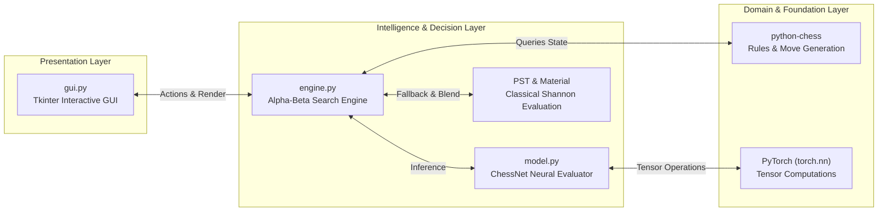
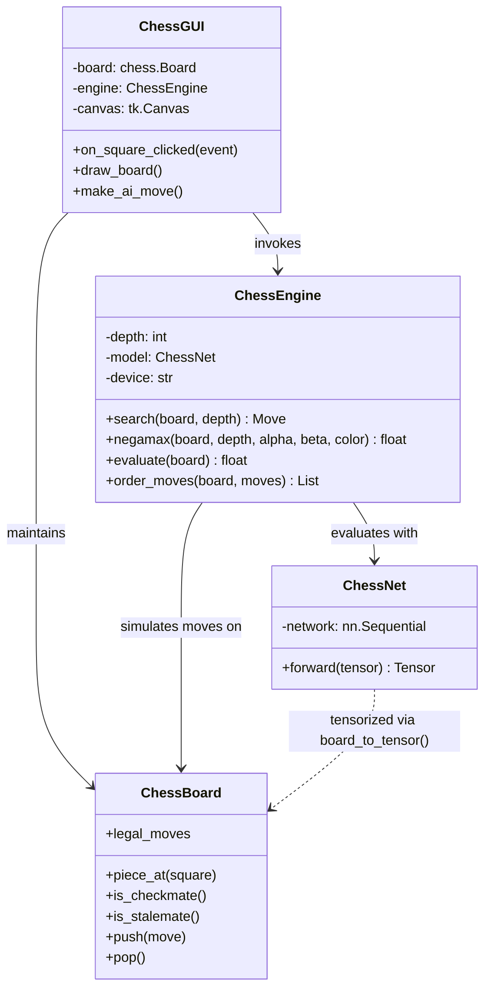

# Product Requirements Document (PRD)
## Project: Chess-Made-Intelligent (AI-Powered Chess Engine & Interactive GUI)

---

## 1. Executive Summary
**Chess-Made-Intelligent** is an intelligent, autonomous chess game and search engine written in Python. It bridges classical algorithmic game theory (Minimax with Alpha-Beta Pruning, Move Ordering, Quiescence evaluation) with deep learning evaluation (PyTorch neural network tensor evaluations).

The system delegates rule enforcement, move legality, castling, en passant, check/checkmate verification, and board state transitions to the battle-tested `python-chess` library. The core intellectual focus is on **representation**, **neural evaluation**, **heuristic search**, and **interactive human-vs-AI gameplay**.

---

## 2. Problem Statement & Objectives

### 2.1 The Problem
Building a chess engine from scratch involves two distinct challenges:
1. **Rule verification and board representations** (64 squares, 50-move rule, threefold repetition, castling rights, en passant, pin detection). Implementing this manually is prone to subtle edge-case bugs that distract from artificial intelligence research.
2. **Game tree intelligence**: The state-space complexity of chess is approximately $10^{43}$ legal positions, with a game tree complexity of approximately $10^{123}$ (Shannon Number). A brute-force search is computationally impossible.

### 2.2 Project Objectives
- **Zero-Bug Rule Base**: Rely entirely on `python-chess` for move generation, legality, and state tracking.
- **Deep Learning Evaluation**: Implement a $12 \times 8 \times 8$ one-hot tensor representation of the chessboard and a multi-layer neural network (`ChessNet`) in PyTorch that outputs an evaluation scalar in $[-1.0, +1.0]$.
- **High-Performance Search Engine**: Implement an adversarial search engine using Negamax with $\alpha$-$\beta$ pruning and Move Ordering (captures, checks, MVV-LVA) to achieve depth 3-5 searches within interactive response times (< 1.5 seconds per move).
- **Graceful Hybrid Fallback**: Blend or fall back to high-speed Shannon/PeSTO piece-square heuristics when neural weights are uninitialized or in rapid quiescence checks.
- **Modern Responsive GUI**: A clean desktop application with interactive click-to-move, legal move indicator highlights, move history, turn/checkmate status indicators, and difficulty depth selection, driven by non-blocking background threading.

---

## 3. User Personas & Use Cases

### 3.1 Primary Persona: The Chess Student & Developer
- Wants to understand how chess algorithms work from first principles.
- Wants to observe how neural networks "see" chess boards as multi-channel spatial tensors.
- Needs clear code structure, transparent mathematics, and visual feedback.

### 3.2 Key Use Cases
| Use Case ID | Name | Trigger | Expected Outcome |
| :--- | :--- | :--- | :--- |
| **UC-01** | Play Game vs AI | User opens GUI, makes move on board | AI computes optimal reply at chosen depth and plays within 1-2s. |
| **UC-02** | Adjust Difficulty | User changes depth dropdown | Engine adjusts search horizon from 1 (Novice) to 4+ (Advanced). |
| **UC-03** | Train Evaluation Network | User runs `model.py` directly | Engine generates synthetic games, evaluates positions, and trains `ChessNet`. |
| **UC-04** | Undo / Restart | User clicks "Undo" or "New Game" | Board rolls back state cleanly without desync or memory leaks. |

---

## 4. Technical Architecture & Component Breakdown

### 4.1 Component 1: `model.py` (Board Representation & Neural Evaluator)
- **Role**: Convert a symbolic `chess.Board` into numerical floating-point tensors and evaluate them using deep neural networks.
- **Input Tensor Dimensions**: $(C, H, W) = (12, 8, 8)$
  - 12 channels representing the 6 piece types $\times$ 2 player colors.
  - Channel 0 to 5: White Pawns, Knights, Bishops, Rooks, Queens, Kings.
  - Channel 6 to 11: Black Pawns, Knights, Bishops, Rooks, Queens, Kings.
  - Each cell is binary: $1.0$ if a piece of that channel resides on square $(r, c)$, else $0.0$.
- **Neural Network Architecture (`ChessNet`)**:
  - `nn.Flatten()`: transforms $(N, 12, 8, 8) \to (N, 768)$.
  - `Linear(768, 256)` followed by `ReLU()`.
  - `Linear(256, 64)` followed by `ReLU()`.
  - `Linear(64, 1)` followed by `Tanh()`.
  - Output range: $[-1.0, +1.0]$, representing win probability / board advantage from Black's perspective $(-1)$ to White's perspective $(+1)$.

### 4.2 Component 2: `engine.py` (Adversarial Search & Decision Making)
- **Role**: Search the game tree to select the optimal move for the AI player.
- **Core Algorithm**: Negamax with Alpha-Beta Pruning.
- **Search Optimization**:
  - **Move Ordering**: Evaluates high-value captures first using MVV-LVA (Most Valuable Victim - Least Valuable Attacker). Captures and checks are searched first, driving $\alpha$-$\beta$ cutoffs early.
  - **Terminal State Detection**: Immediate $+10000$ or $-10000$ scores for checkmate, $0$ for stalemate, 50-move rule, or threefold repetition.
  - **Hybrid Evaluation**: When neural network weights are available, evaluation combines neural score and tactical material balance. If uninitialized, it seamlessly uses classical Shannon piece-square values.

### 4.3 Component 3: `gui.py` (Interactive Graphical User Interface)
- **Role**: Provide an intuitive, responsive graphical desktop interface.
- **Technology**: Python `tkinter` (cross-platform, zero native dependencies).
- **Features**:
  - Crisp board rendering with aesthetic cream & slate/wood square themes.
  - Selected square highlight + circular indicators for legal destination squares.
  - Unicode chess pieces rendered at high resolution.
  - Move history ledger (SAN notation).
  - Background worker thread for AI search to ensure the GUI remains fluid and never freezes during computation.
  - Controls: Reset Game, Undo Move, Flip Board, Depth/Difficulty Selector.

---

## 5. Mathematical Formulations

### 5.1 Spatial Tensor Conversion
For each square $s \in \{0, 1, \dots, 63\}$:
$$\text{row} = \lfloor s / 8 \rfloor, \quad \text{col} = s \pmod 8$$
$$\text{channel} = \text{PieceTypeIndex}(p) + (6 \text{ if } \text{color}(p) = \text{Black else } 0)$$
$$\mathbf{X}_{c, r, k} = \begin{cases} 1.0 & \text{if piece } p \text{ resides on } (r, k) \text{ and matches channel } c \\ 0.0 & \text{otherwise} \end{cases}$$

### 5.2 Multi-Layer Perceptron (MLP) Forward Pass
$$\mathbf{a}^{(0)} = \text{vec}(\mathbf{X}) \in \mathbb{R}^{768}$$
$$\mathbf{z}^{(1)} = \mathbf{W}^{(1)} \mathbf{a}^{(0)} + \mathbf{b}^{(1)}, \quad \mathbf{a}^{(1)} = \max(0, \mathbf{z}^{(1)}) \in \mathbb{R}^{256}$$
$$\mathbf{z}^{(2)} = \mathbf{W}^{(2)} \mathbf{a}^{(1)} + \mathbf{b}^{(2)}, \quad \mathbf{a}^{(2)} = \max(0, \mathbf{z}^{(2)}) \in \mathbb{R}^{64}$$
$$\hat{y} = \tanh(\mathbf{W}^{(3)} \mathbf{a}^{(2)} + b^{(3)}) \in (-1.0, 1.0)$$

### 5.3 Negamax with Alpha-Beta Cutoffs
Let $v(s, d, \alpha, \beta)$ be the value of state $s$ at depth $d$:
$$v(s, d, \alpha, \beta) = \begin{cases} \text{Evaluate}(s) \cdot \text{TurnSign} & \text{if } d = 0 \text{ or terminal}(s) \\ \max_{m \in \text{LegalMoves}(s)} \left[ -v(\text{DoMove}(s, m), d-1, -\beta, -\alpha) \right] & \text{otherwise} \end{cases}$$

Condition for cutoff:
$$\text{If } \alpha \ge \beta \implies \text{Break (Prune remaining subtrees)}$$

---

## 6. Non-Functional Requirements (NFRs)
1. **Response Time**: AI moves at Depth 3 must execute in $< 1.0\text{s}$ on standard CPU hardware. Depth 4 in $< 3.5\text{s}$.
2. **Reliability**: Engine must never crash on unusual chess edge cases (underpromotions, en passant captures, threefold repetition, castling through check).
3. **Usability**: Clean visual cues for selected pieces and legal moves, eliminating illegal user inputs before they reach the engine.
4. **Modularity**: Separation of concerns between `model.py` (AI representation), `engine.py` (search theory), and `gui.py` (interaction).

---

## 7. Verification & Success Criteria
- [x] Board representation properly captures all 12 channels without crashing on empty squares.
- [x] Model trains on synthetic or heuristic dataset and reduces MSE loss smoothly.
- [x] Search engine correctly evaluates tactical forks, free piece captures, and avoids scholar's mate.
- [x] GUI renders board cleanly and smoothly interacts with human player.
