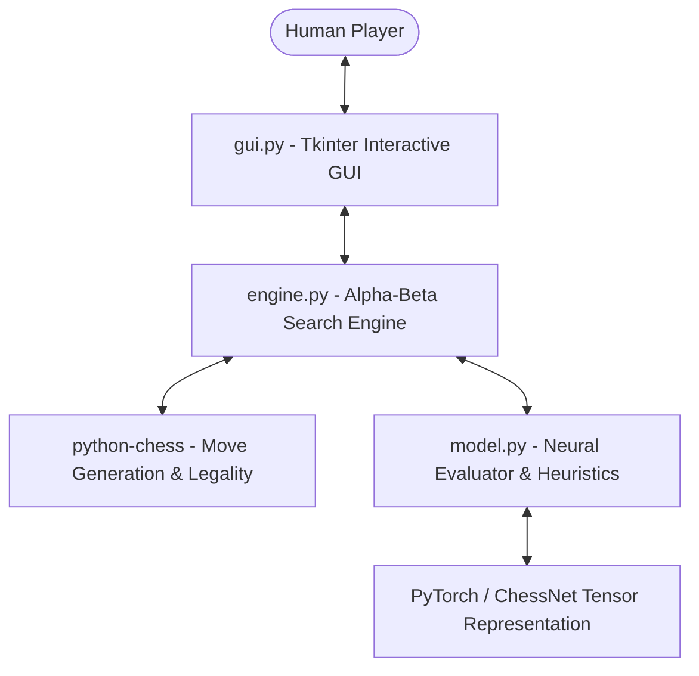

# Chess-Made-Intelligent ♟️🤖

An intelligent, autonomous Chess AI engine featuring a **PyTorch deep learning evaluation network**, an **Alpha-Beta search engine with Move Ordering**, and an **interactive desktop GUI**, powered by `python-chess`.

---

## 📖 Quick Links & Documentation
- 📋 **[Product Requirements Document (PRD)](file:///d:/Aryan/Chess-Made-Intelligent/PRD.md)**: System goals, architectural specifications, data flows, and non-functional requirements.
- 📐 **[Foundations: Concepts, Mathematics & Architecture](file:///d:/Aryan/Chess-Made-Intelligent/docs/CONCEPTS_AND_MATHEMATICS.md)**: From ground zero: $12 \times 8 \times 8$ tensors, MLP forward pass, Negamax, Alpha-Beta pruning proofs, MVV-LVA, and Quiescence search.
- 🧠 **[Deep Dive: `model.py`](file:///d:/Aryan/Chess-Made-Intelligent/docs/EXPLANATION_MODEL.md)**: Line-by-line breakdown of tensor encoding, `ChessNet`, heuristic data generation, and training loops.
- ⚙️ **[Deep Dive: `engine.py`](file:///d:/Aryan/Chess-Made-Intelligent/docs/EXPLANATION_ENGINE.md)**: Line-by-line breakdown of Negamax search, move ordering heuristics, and evaluation blending.
- 🖥️ **[Deep Dive: `gui.py`](file:///d:/Aryan/Chess-Made-Intelligent/docs/EXPLANATION_GUI.md)**: Line-by-line breakdown of Tkinter canvas graphics, coordinate transformations, and background AI threading.
- 📚 **[Under the Hood: The Libraries](file:///d:/Aryan/Chess-Made-Intelligent/docs/EXPLANATION_LIBRARIES.md)**: What `python-chess`, `torch`, and `tkinter` do under the hood.

---

## 🚀 How to Run

### 1. Requirements
Ensure Python 3.10+ (or 3.14) is installed with the required libraries:
```bash
pip install chess torch
```

### 2. Play the Game (GUI)
To start playing against the AI:
```bash
python gui.py
```
- Click any friendly piece to see legal move indicators (green dots for quiet moves, red rings for captures).
- Click a destination square to make your move.
- The AI will automatically think and execute its move on a background thread without freezing the UI.
- Use the sidebar to change difficulty (Search Depth 1 to 4), undo moves, restart, or flip the board to play as Black!

### 3. Test or Train the Neural Network Evaluator
To test tensor conversion and train the `ChessNet` model:
```bash
python model.py
```
This will generate synthetic games, calculate heuristic evaluations, train `ChessNet` via MSE loss with the Adam optimizer, and save weights to `chess_model.pth`.

### 4. Run Search Engine Diagnostics
To test the Alpha-Beta search engine in headless mode and verify tactical problem solving (e.g. Scholar's Mate detection):
```bash
python engine.py
```

---

## 🏗️ Architecture Overview



### Core Components
| File | Responsibility |
| :--- | :--- |
| **`model.py`** | Converts `chess.Board` to a $12 \times 8 \times 8$ tensor; defines `ChessNet` (MLP with ReLU and Tanh); trains and saves weights. |
| **`engine.py`** | Implements Negamax search, Alpha-Beta pruning, MVV-LVA move ordering, Quiescence search, and evaluation blending. |
| **`gui.py`** | Tkinter interactive chessboard with smooth highlights, piece drop-shadows, move history, and non-blocking background search threads. |
